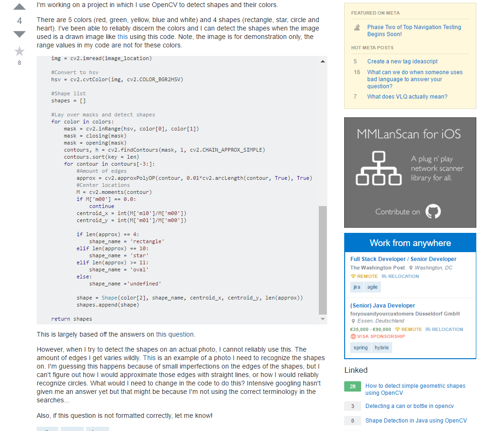
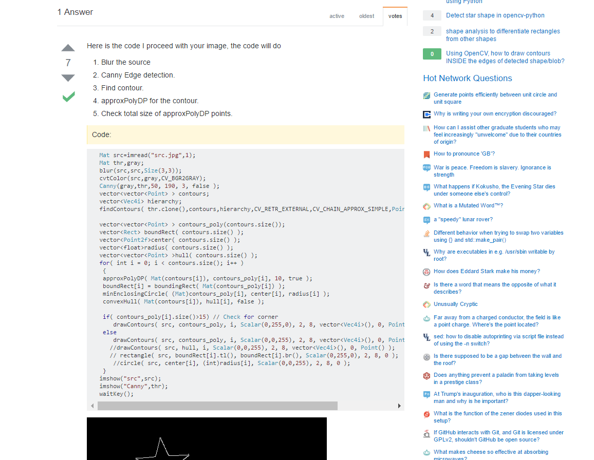

As a software engineer, it’s probably gonna happen where you come across a problem you have a hard time solving. Thus it is time to turn to the glory of the internet, but unless you ask your question the right way it could be a tough time for you and anyone who may try to help. That is why asking your question the smart way could prove to be beneficial to not only you, but others who may find themselves in the same predicament. In a world where the internet is a combination of what seem like an infinity of information, it may be hard to find the answer to your problem, thus forums like stack overflow are great sites to use. Though if you don’t ask your question the right way or give enough data to give someone an ideal of what your bug is, it may come to that your bug may not be solved due to a lack of information. 

There are many examples on stack overflow of questions that are asked the smart way and others that aren’t. In the example <a href="http://stackoverflow.com/questions/22023923/shape-detection-in-python-using-opencv">here</a>, a question that deals with image processing,  this is a question that was asked the smart way. One thing about his/her question is that they describe what they are trying to figure out. The person states that the testing they are doing isn’t exactly reliable for real life situation and what he is trying to achieve. This person also points out that what he is trying to do is based of another question and includes a link to it. This is helpful for someone who is on a similar boat as this person, but maybe a step behind. So while they aren’t exactly at that step it does help them get to that point of where the person that asked the question is at. Another thing that this person adds which helps it be a smart question is the code they use. While it is a little long, it is the entire code that is necessary for someone to see what this person did to get to their point. It points out what the code is suppose to do and even comments that would clarify what a line or function is doing. It is these things that helps this question, become a smart question.

Now for every question there is also an answer and luckily for this person, the person who answered this question did so that would be helpful for asker and others who are in a similar boat. What makes this answer helpful and a “smart answer” is that he/she explains the process to finding the solution to the problem. The person even shows how the code steps of how the solution would work and has example pictures of his code working, which for this case is helpful since it is on image processing. Another plus from this person is that when someone asked for clarification on something they did, the person who answered gave an easy to understand response on what exactly the code was doing.

For every smart question, there is a not so smart question. These types of question can be frustrating because it doesn’t paint a picture on what the person is asking or doesn’t give enough details to figure out what is wrong in the first place. I know I have been at fault for asking a not so smart question. An example of a not so smart question would be this example <a href="http://stackoverflow.com/questions/31238474/spring-security">here</a>. What makes this question not a smart question is it looks like something that the person didn’t fully look up before asking. What this person is asking for is a document or reference to a problem they are trying to solve, which honestly could have been solved with some intense “googling”. From what i can tell from the time stamp is that this problem was easily solved in 5 min after being asked by one person and another 3.5 hours after. This shows that something like this was easy to find and the person probably didn’t spend enough time looking for the answer.

Through looking at examples of both what would be considered a smart question and not so smart question it gives you a perspective on what you should be asking. From experience I know it is frustrating to those I have asked for help from and not really gave them all the necessary details on the problem I am having. I have also been on the other side trying to help those whose questions could have been done by simply googling it for a minute. It reminds me of something my supervisor said about asking question on forums like stack overflow. “Knowing how to properly ask a question can take hours to figure out how to correctly word everything.” and doing so first hand, those words are very true.
